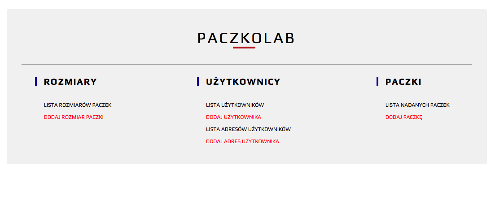
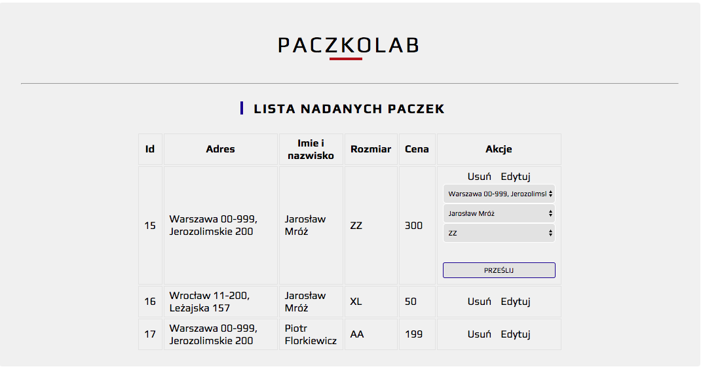

## Paczkolab - REST Api  ##

Configure your database in config.php file:

$servername = "localhost";  
$username = "root";  
$password = "yourpassword";  
$baseName = "Paczkolab";  

$dsn = "mysql:host=$servername;dbname=$baseName;charset=utf8";

<h4> App usage </h4>

&middot; adding users, addresses, boxes, sizes and parcels  

&middot; editing and deleting data using SQL relations 

